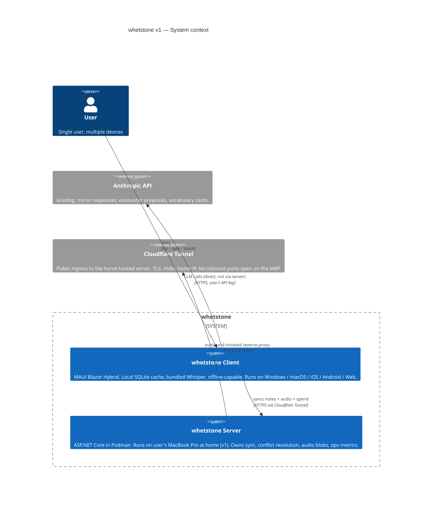

# STABLE.md

The current locked design of whetstone. This document is what *is* — not what *was decided* (see [`decisions/`](./decisions/) for the why) and not what's *in motion* (see [`DRAFT.md`](./DRAFT.md) for that).

When something is locked, it goes here. When it changes, this document is edited in the same commit as the ADR recording the change.

---

## What whetstone is

A personal learning app and knowledge library that turns daily reading, listening, writing, speaking, and re-encounter into a sustainable practice. Built on the principle that **short, daily, joyful practice beats long, sporadic, forced study** — and that growth happens *between* encounters with the same material, not within any single one.

> Growth through daily discipline.

### The loop

```
read / listen  →  capture  →  re-express (write or speak it back)  →  connect
                                                                          ↓
                                                                 revisit later
```

Every day whetstone produces a routine: a small set of revisits from past encounters and slots for new material across the user's active categories.

### What whetstone is NOT

To prevent drift, these negations are part of the spec:

- **Not a flashcard app.** Flashcards (FSRS revisits) are one of several revisit methods, used only where they fit.
- **Not a notes app with optional AI.** LLM grading and reflection are on the critical path of the daily loop.
- **Not a sandbox for the user to define their own loop.** Whetstone is a guide-with-conviction. Defaults are strong; users adapt within the form.
- **Not a productivity tracker.** No streaks, no stats, no gamification. The feedback is the routine itself, and the visible record of your own past writing.
- **Not a knowledge graph.** Linking is one-direction, manual, intentional — not auto-generated.
- **Not a multi-user / team product.** Personal app, single user. The v1 auth model is a single shared bearer token across the user's own devices, not user accounts (see [ADR 0008](./decisions/0008-system-architecture.md)).

---

## The six convictions

These are rules the user cannot turn off. They are what makes whetstone *whetstone*.

1. **Daily encounter beats sporadic effort.** The routine runs every day. Skipping is failure; shrinking is fine.
2. **Joy is fuel, not a luxury.** Ritual slots are sacred — outside revisit queues, never graded, never skipped.
3. **Growth, not retention, is the goal.** Revisiting serves understanding; understanding serves becoming someone. Forgetting is data, not failure.
4. **Templates structure engagement; they do not quiz.** A scaffold for *your* writing, not a slot for the "right answer."
5. **Your past self is the rubric.** What you wrote when you first understood something is the benchmark for whether it still lives in you. The LLM compares; the app does not prescribe truth.
6. **Revisit is not testing; it is meeting your past self with your present mind.** What we resurface, we resurface to grow from — not to score. For some material that meeting looks like a quiz (recitation, vocabulary, mechanism); for other material it looks like reading what you wrote and writing again, with the LLM holding up a mirror to the difference.

### Decision boundary for future features

When a future feature is proposed, judge it against the convictions:

1. **A feature that helps the user *avoid* a conviction is rejected.** Drop-this-card violates #3. Hide-low-grades violates #5. "Quiz me on my diary" violates #6.
2. **A feature that helps the user *fulfill* a conviction more easily is welcomed.** Pause serves #1. Voice capture for diary serves #6 (lower friction → more honest record of past self).
3. **When in doubt, name the conviction the feature touches.** If the feature exists to *bend* the conviction, reject. If it exists to *serve* the conviction, accept.

---

## Methodology

### Direction — the identity anchor (per subject)

Before the user's first encounter in a subject, they write **one or two sentences** declaring why they are studying it and what success looks like in 6-12 months. Not a SMART goal, not a curriculum — a declaration. Examples:

- *"I want to know 史记 well enough to talk about the major figures without notes. Pace doesn't matter. The goal is intimate familiarity, not coverage."*
- *"I want my English writing to feel sentence-rich. I'm studying Orwell because clarity is the foundation. Vocabulary is a means."*
- *"I want to re-read CS:APP and understand it differently — to see how programs become processes become memory, as one mental model."*

The Direction is the steering anchor for every later LLM proposal in that subject. The user reads it at the start of weekly Echo reviews. It is editable — a Direction can mature — but it is always present.

**Why this is in STABLE**: identity-anchored goals (Sheldon self-concordance; Oyserman identity-based motivation) sustain practice across months better than outcome goals. The research backs this more strongly than most other choices in whetstone. See [`RESEARCH.md`](./RESEARCH.md) §6.

### Categories

Each encounter belongs to exactly one category. A category bundles three things: a **template** (what to write or capture when you encounter), a **revisit method** (when and how the encounter is met again), and a **default daily slot weight** (how much of the daily budget it gets).

Five categories ship in v1, with curated material pre-chosen per category. Users can author additional categories and materials in v2 (deferred; see [`BACKLOG.md`](./BACKLOG.md)).

#### 1. Literary narrative
For stories with author, viewpoint, drama.

- **v1 material**: 《史记》, in order: 本纪 → 世家 → 列传.
- **Template**: (1) What's the story? (2) What's the author's view? (3) What do you think? (4) Gems worth taking?
- **Revisit method**: **diminishing schedule with mirror response** — re-encounters at 1d, 7d, 30d, 90d. Each revisit: the app shows the user's original answer; the user writes again on the same encounter ("what's changed for you?"); the LLM produces a mirror response (a paragraph naming the shift between past and present writing, not a grade).
- **Rationale**: Long-form narrative engagement is about the slow deepening of a reader's relationship with the text. Quiz-style testing collapses this. The mirror response respects that growth is the point. The 90-day cap is a principled bet, not a research finding; expected to evolve from real use.

#### 2. Recitation
For passages meant to be memorized verbatim.

- **v1 material**: 《滕王阁序》, 《洛神赋》, 《笠翁对韵》 (continuing past the first five).
- **Template**: (1) Source (2) Passage (3) Context (4) Why this matters to you.
- **Revisit method**: **FSRS with grade-based scoring**. User recalls the passage (written or spoken). LLM compares character-by-character (tolerance for punctuation; strict on words). Four grades: Forgot / Partial / Solid / Stronger.
- **Rationale**: Verbatim retention is the well-studied SRS use case. FSRS over SM-2 because it adapts to per-user forgetting curves (open-spaced-repetition benchmark, ~10,000 users).

#### 3. Prose-modeling (deliberate imitation of writing craft)
For learning to write in a target style by studying sentences from a chosen author.

- **v1 material**: Orwell's *Politics and the English Language*, paragraph by paragraph. Then *Shooting an Elephant*, then *Such, Such Were the Joys*, then other essays in chronological order. *Animal Farm* and other novels deferred — essays are the right unit for this method.
- **Template**: (1) The sentence (or short passage) worth modeling. (2) What you notice — rhythm, word choice, structure. (3) Your rewrite of the same idea in your own words. (4) Where your version loses the music.
- **Revisit method**: **Schedule plus generative revisit.** At 7d, 30d, 90d: the LLM shows the original sentence and the user's old attempt, then asks the user to write a new sentence in the same style about something they're currently thinking about. The LLM responds with a paragraph naming what carried over and what didn't.
- **Rationale**: Writing is a skill domain. Deliberate practice (Ericsson) applies here. The method is how every prose writer has actually learned — Hemingway studying Twain, Baldwin studying James — adapted into a structured daily loop.

#### 4. Concept / mechanism
For logical structures: how something works.

- **v1 material**: CS:APP (already read once by user; this is a re-read in whetstone, which is the strongest use of the revisit framing), front-to-back chapter order, supplemented optionally with one technical paper per month.
- **Template**: (1) What problem does this solve? (2) How does it work? (3) When does it fail or degrade? (4) Trade-off vs alternatives.
- **Revisit method**: **Linked surfacing with re-derivation.** No fixed clock. The concept surfaces when the user encounters related material in any category, and at sparse calendar checkpoints (90d, 365d) as a safety net. On revisit: user re-derives the mechanism from problem statement; LLM compares against the user's original explanation; alternative valid derivations accepted.
- **Rationale**: Concepts integrate with neighbors. Quizzing in isolation breaks them out of context. This is a principled choice, not empirically validated against clock-based SRS for concepts. See [`RESEARCH.md`](./RESEARCH.md) §1 for the honest caveat.

#### 5. Reflection (diary and free writing)
For personal thoughts, daily journaling, processing experiences.

- **v1 material**: free — user writes what they're thinking. Whetstone is the user's diary.
- **Template**: free-form, no scaffold.
- **Revisit method**: **Mirror response on schedule.** At 30d, 60d, 90d, 180d, 365d: the LLM surfaces a past entry and asks "you wrote this 60 days ago — has your mind changed?" The user writes a response. The LLM produces a mirror paragraph naming what shifted. No grade.
- **Rationale**: Reflection's purpose is the writing, but the writing's purpose is encountering one's own evolution. The mirror response is the cleanest expression of Conviction #6.

### Vocabulary as a layer, not a category

Vocabulary is not a top-level category in whetstone. It is a layer that exists *under* every reading category.

**How vocabulary is captured**: while reading any material in whetstone (史记, Orwell, CS:APP, anything), the user can highlight a word or phrase with one tap. The LLM generates a vocabulary card on the spot — word, paraphrased meaning, the surrounding sentence (auto-captured as example), optional etymological hook. The user sees the card and either taps **"Looks right"** (saved) or **"Edit"** (fixes, saves). Median path: one tap to capture, one tap to confirm.

**How vocabulary is revisited**: vocabulary cards flow into a single FSRS queue across all reading. Revisit asks the user to write the meaning in their own words (free recall — the desirable difficulty). LLM grades against the captured definition.

**Why this is in STABLE**: requiring the user to author full cards is exactly the editing tax that breeds procrastination. The LLM does the heavy lifting; the user judges (cheap) rather than authors (expensive). This is the procrastination-defense mechanism for the vocabulary slice.

### Voice as first-class

Voice input is available anywhere text input is. Tap mic, speak, app records. Whisper (running locally on every client) transcribes. The transcript flows into LLM grading and is searchable; the original audio is preserved for playback.

What voice is used for in v1:
- **Diary entries** — speak your day; transcript saved with audio.
- **Recall responses** — speak your answer to a revisit prompt.
- **Recitation** — speak the passage. v1: character-match against the original via transcript; flags substitutions and omissions. v2: pronunciation quality scoring (stress, rhythm, phoneme accuracy).
- **Prose reading aloud** — speak the Orwell paragraph. v1: transcript matched. v2: English pronunciation scoring.
- **Reflection / mirror response** — speak the response if writing feels heavy.

What voice does NOT do in v1:
- No pronunciation-quality scoring for English (deferred to v2; OSS wav2vec2 + MFA stack documented in BACKLOG).
- No literary-quality scoring for Chinese recitation (节奏, 情感, breath — research-thin area).
- No TTS (app reading to you) in v1.
- No real-time streaming transcription — record-then-process.

**Local STT, server-stored audio**: Whisper runs on the client (audio is transcribed locally; transcripts never reach a third party). The original audio bytes are uploaded to the user's own server (MBP at home in v1, user-owned cloud later) over the encrypted Cloudflare Tunnel, so the same recording is playable on every device. Audio never reaches a third-party service. See [ADR 0010](./decisions/0010-audio-sync.md), which supersedes ADR 0006's "audio never leaves the device" stance with "audio never leaves user-controlled hardware."

### Daily loop

```
Today's routine
├── 🎯 Ritual    (笠翁对韵-style daily reading, ~10 min)
│       └── Checkbox, no template, no grading. Sacred. Optional voice recording.
│
├── 🔁 Revisit   (capped at 15 items/day, interleaved across categories)
│       └── For each item, the category's revisit method runs:
│           – Recitation / Vocabulary: prompt → free recall → LLM grades (4 grades)
│           – Concept: prompt → re-derive → LLM grades against original
│           – Narrative / Reflection / Prose-modeling: show original → user writes again → LLM mirror response
│
├── 📖 Encounter (new material, 1-2 slots per active category)
│       └── For each slot:
│           1. App proposes the next encounter within the category's curated material,
│              with a one-sentence rationale referencing the Direction.
│           2. User accepts / "not today" (lighter alt) / "something else" (user types).
│           3. User reads or listens; fills the category's template.
│           4. Saved as a Note; enters category's revisit queue.
│           5. While reading, one-tap vocabulary capture available.
│
└── 🔗 Connect   (1 manual link/day from new Note to existing Note)
        └── Free-text "Related: see [[note-id]]" in body.
```

### Weekly Echo review (every 7th day replaces the standard routine)

Once a week, the routine shifts:

- **Read your Direction** for each active subject.
- **Three to five past entries** surface from 30/60/90/180/365 days ago, paired where possible with a recent entry on a similar theme.
- For each pair, the user writes a short reflection: *"what's the same? what's different? where am I now?"*
- LLM responds with a mirror paragraph naming the drift.
- No grading, no scheduling impact. The Echo's purpose is for the user to see their own evolution.

**Why this is in STABLE despite thin research backing**: it is the cleanest operationalization of Conviction #6, and the cost of building it is small. If 4 weeks of real use show users skip it, it gets cut and revisited.

### Revisit queue selection (the cap mechanism)

When the revisit queue has more than 15 items eligible today:

1. Bucket items by category.
2. Round-robin across categories with eligible items, picking most-overdue first within each.
3. Fill until cap is reached.
4. Items left over: next-surface date pushed forward by 1 day.

This prevents one category from dominating the day.

**Honest caveat**: cross-category interleaving is operationally useful (engagement, balance) but the interleaving research (Brunmair & Richter 2019, g ≈ 0.42) is about discriminating similar items within a domain. Whetstone's cross-category interleaving is task-switching, not literature-backed for retention. See [`RESEARCH.md`](./RESEARCH.md) §4.

### New-encounter slot sizing

Each category has a default weight. Daily time available for encounters (budget minus ritual minus revisit) is split by weight. The five v1 categories:

| Category | Weight | Typical session |
|---|---|---|
| Concept/mechanism (CS:APP) | 3 | ~45 min weekday, ~90 min weekend |
| Literary narrative (史记) | 2 | ~30 min weekday, ~60 min weekend |
| Prose-modeling (Orwell) | 2 | ~20-30 min |
| Recitation | 1 | ~15 min |
| Reflection (diary) | 1 (always available) | varies |

### LLM grading and proposal

LLM is on the critical path twice: as **grader** (for revisits that take a grade) and as **proposer** (for daily encounter slots). Self-grading remains as fallback for grading when the budget is exhausted, never as default.

**Four grades** (apply only to recitation, vocabulary, concept):
- **Forgot** — couldn't recall or recalled wrong.
- **Partial** — got the gist but missed key parts.
- **Solid** — matched original understanding.
- **Stronger** — recall is *better* than original (added nuance, clearer thinking). Signals integration.

**Mirror response** (apply to narrative, reflection, prose-modeling): no grade. A paragraph from the LLM naming the delta between past and present writing.

**Cost controls (all v1):**
1. **Daily budget cap**: configurable, default **$0.25/day** (~150 graded items at Haiku 4.5 pricing). When exhausted, grading falls back to self-grade; proposal falls back to round-robin through unread material.
2. **Per-request token cap**: 2,000 input tokens. Long source truncated with notice.
3. **Visible spend log**: settings shows today, this month, rolling 30-day average.

**Model choice**: Haiku 4.5 default. Opus 4.7 only when user explicitly flags an item for deep review.

### Pause mechanism

A user's life is not uniformly available. Pause is the conviction-aligned escape: declared, visible, time-bounded.

**Category pause** — applied to a single category. Queue freezes, no new dues accrue, no new-encounter slots offered. Other categories continue. Resume shifts due dates forward by pause duration.

**Loop pause** — applied to the whole app. All revisits and new-encounter slots suppressed. Ritual pauses by default; user can opt to keep it. Resume shifts every revisit item's next-surface date forward by pause duration. **No FSRS recalculation, no lapses recorded, no penalty, no shame.**

Math: `new_due_date = old_due_date + pause_duration`.

**What pause does NOT allow:**
- **No item-level pause.** Drop-button in disguise; violates Conviction #3.
- **No retroactive pause.** Past skipping was skipping.
- **No silent pause.** Settings always shows active pause status.

---

## Stack

| Layer | Choice | Why |
|---|---|---|
| Framework | **.NET MAUI Blazor Hybrid** | One codebase → PWA + native iOS/Android/Windows/Mac. Real native shell is a stated future goal. |
| Storage (client) | **SQLite via EF Core, local cache + pending-sync queue** | Local-first; reads from cache, writes locally first then sync. Works fully offline. See [ADR 0008](./decisions/0008-system-architecture.md). |
| Audio | **Whisper (whisper.cpp / faster-whisper)**, model bundled with client | Local STT on every device. Original audio uploaded to user's own server for cross-device playback (per [ADR 0010](./decisions/0010-audio-sync.md), superseding the "audio never leaves the device" claim in ADR 0006). Adds 100-500 MB to app size depending on model selected. |
| Storage abstraction | **`INoteStore` interface** | `SqliteNoteStore` now, `RemoteApiNoteStore` later. |
| Grader abstraction | **`IGrader` interface** | `AnthropicGrader` v1, `OllamaGrader` later, `SelfGrader` always. |
| Audio abstraction | **`IAudioProcessor` interface** | `WhisperAudioProcessor` v1 (local STT). Pronunciation-scoring implementations deferred to v2. |
| Note format | **Markdown body + YAML frontmatter** | Plain text, human-readable, export = serialize → `.md` file. Audio referenced by filename, stored alongside. |
| Sync | **Server-mediated cross-device sync in v1** | Personal-knowledge-library promise requires phone↔desktop continuity. See [ADR 0008](./decisions/0008-system-architecture.md). |
| Server runtime | **ASP.NET Core 8 in Podman, multi-arch OCI image** | Same image runs on MBP (Apple Silicon) and any cloud Linux host. Migration is config + data move. |
| Server host (v1) | **User's MacBook Pro at home, exposed via Cloudflare Tunnel** | $0/month recurring; user-owned hardware preserves privacy posture. |
| Server storage | **Postgres 16 + local disk for audio blobs** behind `IAudioBlobStore` | Postgres runs identically across hosts. `IAudioBlobStore` is the fourth seam, scoped to the server, swaps to S3-compatible on cloud migration. |
| Auth | **Shared bearer token + network-layer trust (Cloudflare Tunnel)** | Two-layer defense in depth. Single user; token rotated via SSH. No accounts, no login UI. |

Real seams: **four total** — `INoteStore`, `IGrader`, `IAudioProcessor` (client), and `IAudioBlobStore` (server). Any new interface needs an ADR.

---

## System architecture

The system in one picture. Full reasoning, diagrams (container view, component view, sequence diagrams, deployment view), trade-offs, and cross-cutting concerns are in [ADR 0008](./decisions/0008-system-architecture.md). This section is what the team holds in shared memory — the picture and the headline decisions.

### The system at a glance



### Architectural drivers (what we are optimizing for)

In priority order:

1. **Cross-device continuity** — phone, desktop, and web see the same notes within seconds.
2. **Conviction #1 (daily encounter)** — works offline, on the subway, when the home server is rebooting. Offline is the common case.
3. **Conviction #6 (revisit as meeting past-self)** — grade and mirror flows are structurally separate, not flagged variants.
4. **Privacy** — notes and audio live on user-controlled hardware; never reach a third party.
5. **Low recurring cost** — ~$0/mo at the host layer in v1 (MBP electricity + Cloudflare free + Anthropic per-use).
6. **Portability** — host migration (MBP → cloud) is config + data move, no code change.
7. **Operational simplicity** — one user can keep it running.

### Headline decisions

| Decision | What | Why |
|---|---|---|
| **Server in v1** | ASP.NET Core HTTP service on MBP at home | Personal-knowledge-library promise requires cross-device sync. Deferring fails the "open Windows app, see yesterday's phone diary" test. |
| **Local-first client** | SQLite cache + pending-sync queue on every device | Conviction #1: app always works, never blocks on network or server. |
| **Anthropic direct from client** | Server is not in the LLM critical path | Server outage cannot break grading. API key stays on user devices, no central custody. |
| **MBP at home as v1 host** | Cloudflare Tunnel exposes a private port | $0/mo. User-owned hardware. Migrates cleanly to Ali Cloud / Azure / anywhere when MBP limits bite. |
| **Podman OCI image** | Multi-arch build (linux/amd64 + linux/arm64) | Same image runs on MBP and any cloud host. Lower idle footprint than Docker. Rootless by default. |
| **Last-write-wins by `edited_at`** | Server-side history table archives overwritten versions | No conflict UI to build for v1; recovery escape hatch exists for the rare silent overwrite. |
| **Audio syncs across devices** | Original audio uploaded to user's own server | Supersedes "audio never leaves the device" (ADR 0006) — replaced with "audio never leaves user-controlled hardware" ([ADR 0010](./decisions/0010-audio-sync.md)). |
| **Shared bearer token + tunnel auth** | Two-layer defense: Cloudflare verifies tunnel, server verifies token | No account system needed for single user. Rotate via SSH. |
| **Server-side ops metrics + crash reports** | No usage analytics (Conviction #3) | Find bugs across devices. No vanity metrics, even self-hosted. |

### Component inventory

**Client** (14 components, full detail in [ADR 0008 §4](./decisions/0008-system-architecture.md)): UI, `RoutineGenerator`, `EchoComposer`, `EncounterProposer`, `FsrsScheduler`, `DiminishingScheduler`, `LinkedSurfacingScheduler`, `INoteStore`/`LocalNoteStore`, `IGrader`/`AnthropicGrader`+`SelfGrader`/`AnthropicGraderWithFallback`, `IAudioProcessor`/`WhisperAudioProcessor`, `SpendTracker`, `PauseState`, `VocabularyCapture`, `SyncEngine` (new), `ExportService`.

**Server** (~10 components, full detail in [ADR 0008 §5](./decisions/0008-system-architecture.md)): `BearerTokenAuthMiddleware`, `SyncController`, `ConflictResolver`, `HistoryWriter`, `AudioBlobController`, `IAudioBlobStore`/`LocalDiskAudioBlobStore`, `MetricsRecorder`, `CrashReportReceiver`, `AdminEndpoints`, Postgres + EF Core.

Explicitly **not** components: no `IScheduler` abstraction, no `IClock`, no `RoutineService`/`LearningEngine` god-class, no `ICostPolicy`, no `IExporter`, no event bus, no domain events, no `*Manager`, no `*Helper`. Adding any new component requires an ADR.

### Failure modes (deployment view)

| If this fails | Sync impact | LLM impact | App usable? |
|---|---|---|---|
| Home internet | sync stops | none (client → Anthropic direct) | yes, fully |
| MBP asleep / off | sync stops | none | yes, fully |
| Postgres on MBP | sync errors at server | none | yes, fully |
| Cloudflare edge | sync stops | none | yes, fully |
| Client device offline | sync stops on that device | grading offline → self-grade fallback | yes |
| Anthropic API | none | grading offline → self-grade fallback | yes |

**No single failure prevents the user from doing today's routine.** Strongest validation against Conviction #1.

### Project layout — two .NET projects, flat folders by feature

```
whetstone.sln
├── client/    ← MAUI Blazor Hybrid (Notes, Subjects, Routine, Echo, Grading, Audio,
│                Spend, Pause, Vocabulary, Sync, Export, Pages, Components)
├── server/    ← ASP.NET Core minimal API (Sync, Audio, Auth, Ops, Storage)
├── shared/    ← Contracts (DTOs referenced by both)
└── ops/       ← Containerfile, compose.yaml, CI workflows, MBP setup runbook
```

Per [Engineering principles](#engineering-principles): no layered folders inside either project. `Pages/` and `Components/` are MAUI Blazor convention.

### Forward-compatibility (these v1.5 / v2 moves require no code change)

- **Mobile build**: MAUI handles the target. Smaller Whisper bundle on mobile is the only platform-conditional concern.
- **Cloud host migration** (MBP → Ali Cloud / Azure / AWS): swap the OCI image's deploy target, `pg_dump`/`pg_restore`, `rsync` audio blobs, swap `IAudioBlobStore` from local-disk to S3-compatible via config, repoint Cloudflare Tunnel. One day's work. See [ADR 0008 §12](./decisions/0008-system-architecture.md).
- **Ollama local grading**: new `OllamaGrader : IGrader`. ADR at that time.
- **Pronunciation scoring**: extend `IAudioProcessor`; decorate Whisper. v2 per [ADR 0006](./decisions/0006-voice-first-class.md).
- **User-authored categories**: confined to `Subjects/` folder. v2 per [BACKLOG.md](./BACKLOG.md).

---

## Scope (v1)

The minimum that runs the full loop end-to-end on desktop (Windows + WebAssembly). Mobile build follows in v1.5 or v2.

### In v1

1. **Today screen** — day's routine: revisits (capped 15, interleaved), new-encounter slots per active category, daily ritual checkbox, weekly Echo review every 7th day.
2. **Revisit an item** — per category's method (graded for recitation/vocab/concept; mirror response for narrative/reflection/prose-modeling). Self-grade fallback when budget exhausted.
3. **Encounter — LLM proposes** the next encounter within curated material, with one-sentence rationale referencing the Direction. User accepts / "not today" / "something else." Encounter completed by filling the category's template.
4. **Voice input everywhere** — tap mic anywhere text input is accepted; Whisper transcribes locally; audio stored with note.
5. **One-tap vocabulary capture** — highlight a word during any reading → LLM generates card → user confirms or edits → saved to single FSRS vocabulary queue.
6. **Direction per subject** — user writes 1-2 sentences when starting a subject; editable any time; LLM uses as proposal anchor; shown at start of Echo reviews.
7. **Five default categories shipped in code with curated v1 material**: literary narrative (史记), recitation (滕王阁序/洛神赋/笠翁对韵), prose-modeling (Orwell essays in order), concept/mechanism (CS:APP), reflection (free diary). User-authored categories and materials deferred to v2.
8. **`AnthropicGrader` + `SelfGrader` + `WhisperAudioProcessor`** are the v1 implementations. Anthropic API key configured in settings.
9. **Cost controls**: daily budget cap (default $0.25), per-request token cap (2,000 input), visible spend log.
10. **Pause** — category-level and app-level, with date-shifting on resume.
11. **Weekly Echo review** — every 7th day, surfaces 3-5 past entries paired with recent ones; user reflects; LLM mirror response.
12. **Export everything** — Settings → "Download all notes + audio + spend log as `.zip`". Files are real `.md` with frontmatter, audio in original format, spend log as CSV.
13. **Local-first client + server-mediated cross-device sync.** Each client holds a SQLite cache + pending-sync queue; app works fully offline. Server (ASP.NET Core in Podman on user's MBP at home, exposed via Cloudflare Tunnel) holds canonical Postgres + audio blobs. Notes + transcripts + audio + spend all sync. Last-write-wins by `edited_at`; server-side history archives overwritten versions. Shared bearer token auth. See [ADR 0008](./decisions/0008-system-architecture.md), [ADR 0010](./decisions/0010-audio-sync.md).
14. **Server portability**: same OCI image runs on MBP today and on Ali Cloud / Azure / AWS later. Storage seams (`IAudioBlobStore` for audio; standard Postgres for data) make migration config + data move, no code change.

### Out of v1 — see [`BACKLOG.md`](./BACKLOG.md)

Notable deferrals: cloud-hosted server (v1 ships MBP-at-home; cloud migration recipe in [ADR 0008 §12](./decisions/0008-system-architecture.md)), mobile build (native iOS/Android), pronunciation-quality scoring, Chinese recitation literary scoring, TTS, local LLM (Ollama) grading, user-authored categories and materials, tags/search, backlinks, push notifications, themes, multi-user / accounts, conflict-resolution UI, CRDT-based merge.

### Discipline rule

If during construction an idea arrives — *"I should also add X"* — it goes in [`BACKLOG.md`](./BACKLOG.md), not into v1. **Nothing** gets added to v1 after this lock without explicit user confirmation.

---

## Engineering principles

### Code

- **Microsoft C# / .NET conventions**, enforced by `dotnet format` + `.editorconfig`.
- **Nullable reference types: on, warnings as errors.**
- **Async all the way.** Any I/O method returns `Task<T>`. No `.Result`, no `.Wait()`.
- **One class per file.** Filename matches type name.
- **Class is the default. Interface is the exception.** Four real seams exist: `INoteStore`, `IGrader`, `IAudioProcessor` (client), and `IAudioBlobStore` (server, added by [ADR 0008](./decisions/0008-system-architecture.md) for host-portable audio blob storage). Any new interface needs an ADR.
- **No factories, no abstract base classes, no `*Manager` / `*Helper` classes** in v1. Name classes for what they do.
- **Comments answer *why*, not *what*.** If a comment paraphrases the code, delete the comment and rename the variable.

### Tests

- **Unit tests on pure logic only.** Schedulers (FSRS, diminishing-schedule, linked-surfacing), `RoutineGenerator`, grading-result parsing, vocabulary-card generation prompts (offline structure tests).
- **No tests on**: SQLite I/O, UI components, MAUI bootstrap, network calls, Whisper transcription quality.
- **xUnit + FluentAssertions.**
- **Test names**: `Method_Condition_Expected`.

### Commits

- **Conventional Commits.** `feat:`, `fix:`, `docs:`, `refactor:`, `test:`, `chore:`. Imperative voice.
- **One logical change per commit.**
- **Commit message body explains *why*, not *what*.**
- **Direct push to `main`.** No PR ceremony. (Agents do not push — see AGENTS.md.)

### CI

- **GitHub Actions on every push to `main`.**
- **Pipeline**: `dotnet restore` → `dotnet build --no-restore` → `dotnet test --no-build`.
- **Pre-commit hook**: `dotnet format` only. Tests run in CI.
- **Red CI is red CI.** If main is broken, fix it before next feature.

### Decisions

- **ADRs in [`decisions/`](./decisions/).** Every decision worth re-litigating becomes an ADR. Format: numbered, dated, with Context / Decision / Alternatives / Consequences / Revisit triggers.
- **ADRs are append-only.** To reverse a decision, write a new ADR that supersedes the old one; mark the old one's status. Never edit a locked ADR's substance.
- **Same-commit rule**: any ADR that locks a new decision or supersedes an old one MUST update this STABLE.md in the same commit.

### Anti-rules — explicitly NOT doing in v1

- ❌ No repository pattern wrapping EF Core. `DbContext` is already that.
- ❌ No CQRS / MediatR.
- ❌ No Result<T> / Either monad. Throw exceptions; let MAUI handle.
- ❌ No layered architecture folders (Domain/Application/Infrastructure/Presentation). Flat folders by feature.
- ❌ No AutoMapper. Hand-write the few mappings the app needs.
- ❌ No background workers, no message queues, no caching layer for grading.
- ❌ No localization framework — v1 is English UI only. (Notes themselves are multilingual; the app chrome is not.)
- ❌ No streaming audio. v1 is record-then-process.

These are v1-scoped, not lifetime bans. Each is on the table for v2 if a real need surfaces.

### Revisit triggers

The engineering principles get revisited after v1 has been used daily for ≥ 2 weeks. Concrete trigger: a bug class appears that this ruleset failed to prevent.

---

## Cross-references

- **Why decisions are what they are**: [`decisions/`](./decisions/) ADR history. The architecture-relevant ADRs: [0001 (stack)](./decisions/0001-stack-and-storage.md), [0002 (engineering principles)](./decisions/0002-engineering-principles.md), [0006 (voice)](./decisions/0006-voice-first-class.md), [0008 (system architecture)](./decisions/0008-system-architecture.md), [0010 (audio sync)](./decisions/0010-audio-sync.md).
- **What cognitive learning science says about whetstone's choices**: [`RESEARCH.md`](./RESEARCH.md).
- **How code review works**: [`REVIEW_SPEC.md`](./REVIEW_SPEC.md) (owned by Architect). Stack-specific research notes that informed the SPEC: [`REVIEW_NOTES.md`](./REVIEW_NOTES.md).
- **How the agent team operates**: [`COWORK.md`](./COWORK.md). Multi-agent architecture research that informed it: [`AGENT_TEAM_RESEARCH.md`](./AGENT_TEAM_RESEARCH.md).
- **What's in motion right now**: [`DRAFT.md`](./DRAFT.md).
- **What's deferred**: [`BACKLOG.md`](./BACKLOG.md).
- **Rules agents must follow**: [`AGENTS.md`](./AGENTS.md).
