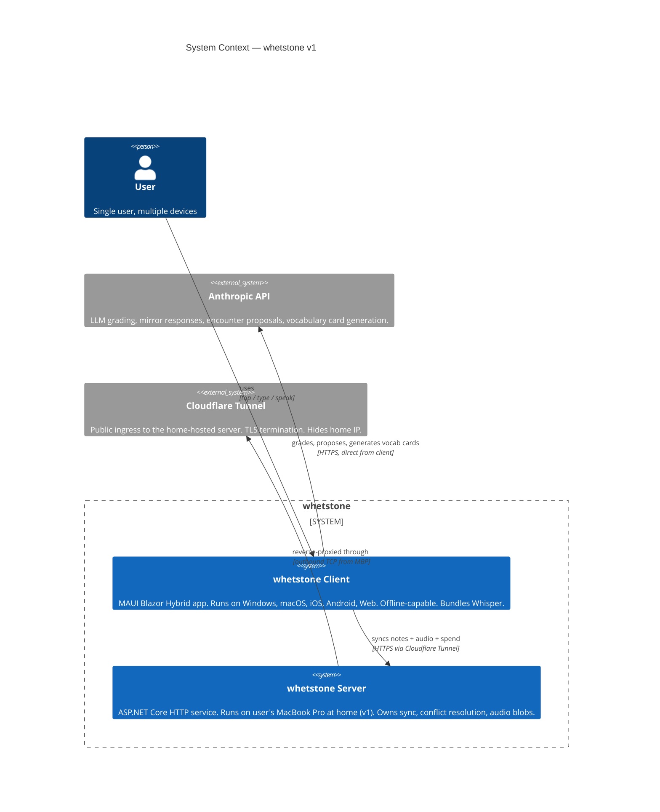
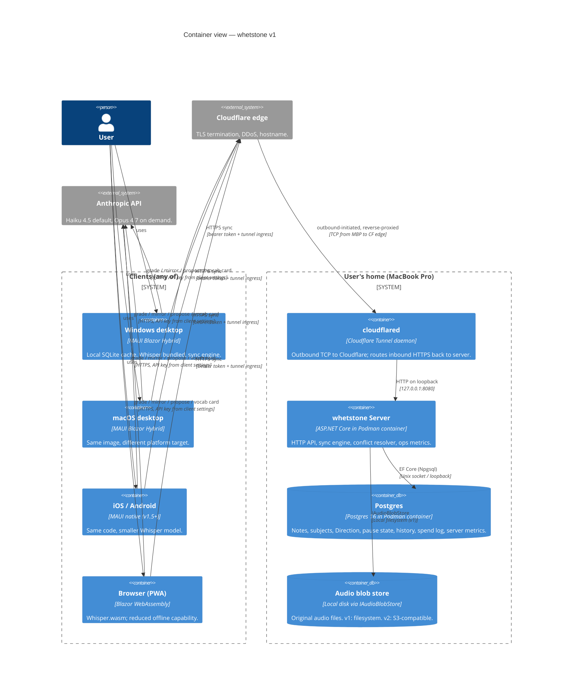
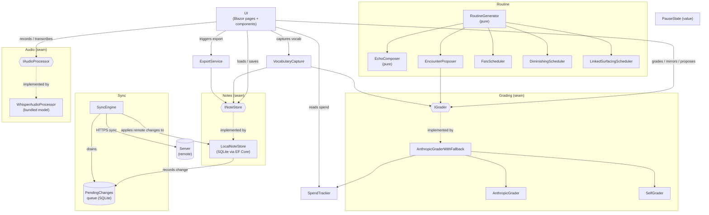
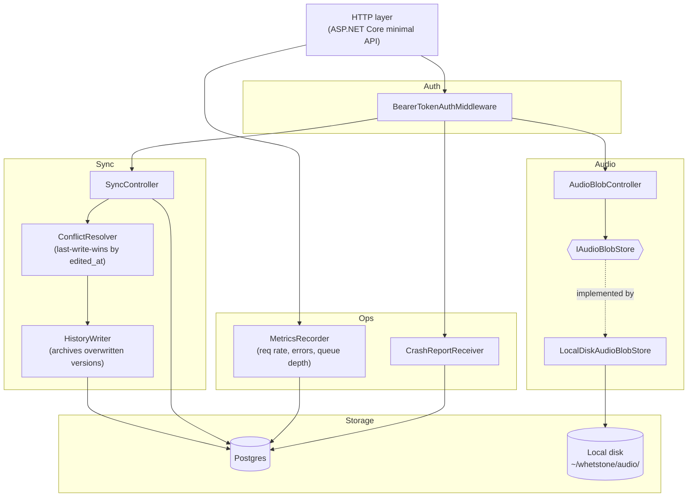
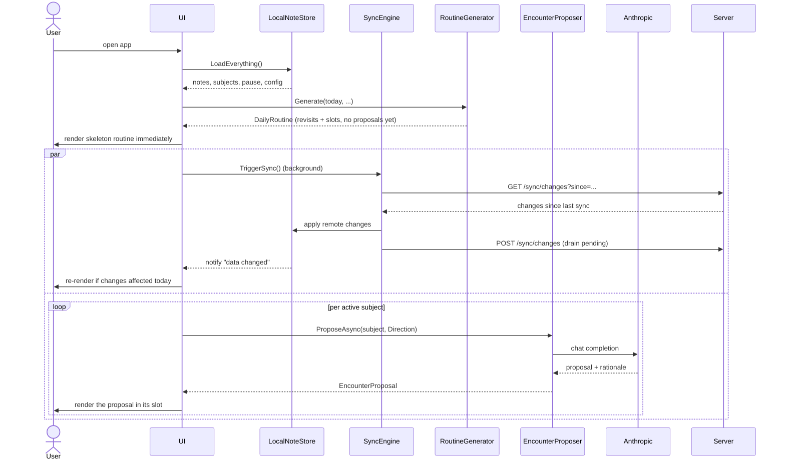
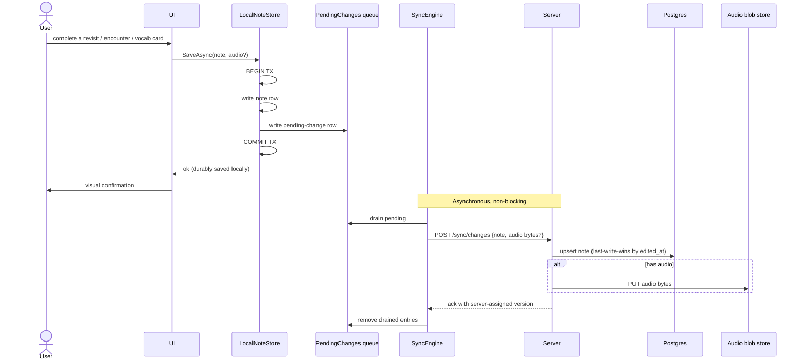
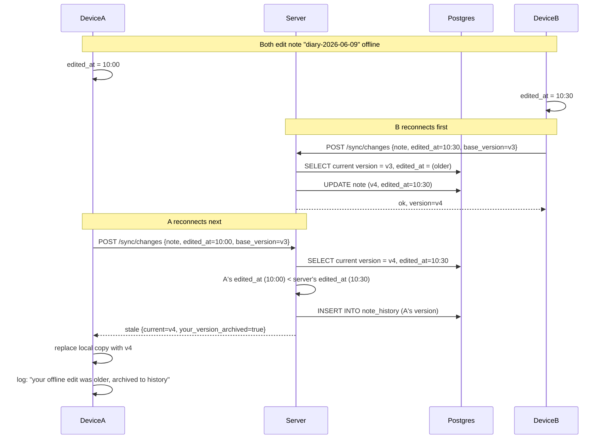
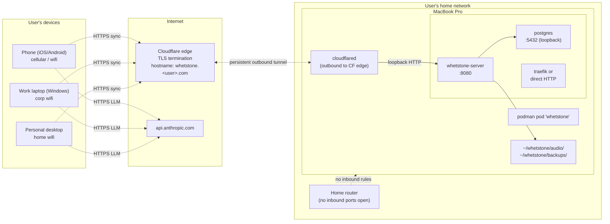

# ADR 0008 — System architecture

**Date:** 2026-06-09
**Status:** Accepted
**Supersedes:** Parts of [ADR 0001](./0001-stack-and-storage.md) ("Local-first storage chosen over cloud-from-day-one"; "Sync: None in v1")
**Partially superseded by (in same commit):** [ADR 0010](./0010-audio-sync.md) on audio sync semantics.
**Amended by:** [ADR 0011](./0011-content-as-server-data.md) — Postgres also holds `materials`, `prompt_templates`, `categories`, and `default_settings` tables (in addition to notes + history). The sync protocol gains `GET /v1/sync/content` and `GET /v1/sync/prompts`. The `NoteDbContext` referenced below is now `WhetstoneDbContext` to reflect the broader scope. [ADR 0012](./0012-admin-role.md) adds admin-scoped bearer tokens and the `POST /v1/admin/...` write endpoints.

## Context

ADRs 0001–0007 locked methodology, voice scope, pause, and the agent team. They did not lock the **system architecture** — how the pieces fit together as a system, what runs where, how clients talk to each other across devices, what the failure modes look like across the boundary.

The previously held position (ADR 0001) was that v1 ships with **no server and no sync**; cross-device continuity was deferred to v2 via manual export/import. That position fails the basic test of a personal knowledge library: *"if I open the Windows app, is yesterday's diary entry from my phone there?"* If the answer is "only after a manual zip+import," whetstone has not become the single place for the user's intellectual work — which is the user-stated reason whetstone exists ([ADR 0006 → Context](./0006-voice-first-class.md#context)).

Architectural drivers, in priority order:

1. **Cross-device continuity** — phone, desktop, and web must see the same notes within seconds.
2. **Conviction #1 (daily encounter)** — the app must work even when the network is poor, the home server is rebooting, or the user is on the subway. Offline is the common case, not the exception.
3. **Conviction #6 (revisit is meeting past-self, not testing)** — grade-based and mirror-based revisit paths must remain structurally separate, not flagged variants of one path.
4. **Privacy** — notes and audio are personal-knowledge-library content. Data lives on hardware the user controls, traverses networks the user trusts, and is never sold to a third party.
5. **Low recurring cost** — the user wants whetstone to be a tool they keep using for years. Hosting must not be a monthly tax that argues against keeping it.
6. **Portability** — the user has named willingness to migrate hosts (MacBook at home now; Ali Cloud or other later). Architecture must not couple to one host.
7. **Simplicity of operation** — single user, no team. Operating the system must not require more than the user is willing to maintain.

Four user decisions taken during this ADR's drafting that shape what follows:

- Server **in v1**, not deferred. Sync is a v1 capability.
- Host (v1): **the user's MacBook Pro at home**, exposed via **Cloudflare Tunnel**, with the system designed for portable migration to **Ali Cloud (China mainland)** or other hosts later.
- **Audio syncs across devices** (supersedes the local-only stance of ADR 0006; see [ADR 0010](./0010-audio-sync.md)).
- **Local-first** client with full offline-capable SQLite cache; **last-write-wins** conflict resolution with server-side history as safety net; **shared bearer token** auth on top of network-layer trust; **server-side operational metrics + client crash reports**, no usage analytics (Conviction #3).

## Decision

### 1. The system at a glance



**Key shape decisions encoded above:**

- **Two real systems**: client and server. Both are whetstone's responsibility.
- **Anthropic is called direct from the client**, not proxied through the server. This keeps the LLM critical path independent of the server's reachability (Conviction #1) and keeps the user's API key in their own client-side settings — no central API-key custody on the server.
- **Cloudflare Tunnel** is the only public-internet surface. The MBP has no inbound ports open to the internet; the tunnel daemon makes an outbound connection to Cloudflare and Cloudflare proxies requests back through it.

### 2. Quality attributes (what we are optimizing for, what we are trading away)

| Attribute | Target | How achieved | What we trade |
|---|---|---|---|
| **Availability (read)** | 100% offline-capable | Local SQLite cache on every client | Slightly stale data when offline |
| **Availability (sync)** | Best-effort, eventually consistent | Server is single MBP; downtime is expected and acceptable | No SLA; sync gap during MBP reboots/updates |
| **Consistency** | Eventually consistent across devices | Sync-on-launch + sync-on-save + 5min poll | A device can lag minutes behind another in normal use |
| **Privacy** | Personal data never leaves user-controlled hardware | MBP-at-home + Cloudflare Tunnel (encrypted) + per-user API key | Cloudflare sees TLS-encrypted bytes (not content) |
| **Cost (recurring)** | < $5/month total | MBP electricity ~$1/mo + Cloudflare free + Anthropic ~$3-10/mo per usage | One-time MBP hardware cost, accepted |
| **Portability** | Migrate host in 1 day, no code change | OCI image + DB + blob seams behind interfaces | More code than a host-locked design |
| **Operational simplicity** | One user can keep it running | Single container + auto-restart + Cloudflare-managed TLS | No multi-region, no HA, no managed-DB convenience |
| **Conviction-#1 fit** | Subway / plane / MBP-down still works | Local-first; no UI action ever blocks on server | More code (sync queue, conflict policy) |
| **Conviction-#6 fit** | Grade and mirror flows structurally separate | Two methods on `IGrader`, two result types, two UI surfaces | None — this is structural cost-free |
| **Time-to-first-use** | First daily routine within 2-4 weekends | Single MAUI codebase + small server | Slower than a webapp-only v1 |

**Not optimizing for in v1**: multi-user, multi-region, horizontal scale, sub-second sync, formal SLAs, fine-grained ACLs. All revisit triggers if whetstone ever grows beyond personal use.

### 3. The system at container level



**Key shape decisions encoded above:**

- **Clients call Anthropic directly.** The server is not in the LLM critical path. If the MBP is down, you can still grade and propose — you just can't sync. This is the most important availability decision in the system.
- **Server has three containers in one pod**: `cloudflared`, `whetstone-server`, `postgres`. Managed by `podman pod` or a single `compose.yaml`. One unit; either all up or all down.
- **Audio blobs live on the MBP's local disk in v1** (behind `IAudioBlobStore`). In v2 / on cloud migration, the same interface accepts an S3-compatible store (Ali Cloud OSS, Azure Blob, AWS S3, MinIO).
- **Cloudflare Tunnel is the only network ingress.** The MBP's firewall has no inbound rules; `cloudflared` initiates the outbound connection. Nothing publicly listens on the MBP.

### 4. Client architecture (component view)



**Notes on the client view:**

- **The seams (`INoteStore`, `IGrader`, `IAudioProcessor`) are unchanged from prior STABLE.md.** This ADR validates them by showing they hold under the sync-and-server addition.
- **`SyncEngine` is new.** It is the only component that talks to the server. It reads from / writes to the pending-changes queue (a SQLite table inside the local DB) and applies inbound server changes through `LocalNoteStore`. The UI never knows the server exists.
- **`LocalNoteStore` records every change into `PendingChanges`** as part of the same DB transaction. Saves are atomic: either both the note and the pending-sync entry land, or neither does. No "saved but didn't sync" half-state.
- **`AnthropicGrader` calls Anthropic directly from the client**, not via the server. The server is not in this critical path. Sync survives Anthropic outages; LLM grading survives server outages.

### 5. Server architecture (component view)



**Notes on the server view:**

- **Minimal API style** (no controllers, no MVC ceremony — matches the "no layered architecture" anti-rule).
- **`ConflictResolver` is the only place sync semantics live.** Last-write-wins by `edited_at` timestamp; overwritten version archived to `note_history` table. UI never sees history in v1; an admin API endpoint can read it on demand.
- **`IAudioBlobStore` is the storage seam for blobs.** v1: `LocalDiskAudioBlobStore` writes to `~/whetstone/audio/{noteId}/{audioId}.{ext}`. Future: `S3CompatibleAudioBlobStore` with three connection-string-based implementations (Ali Cloud OSS, Azure Blob, AWS S3) — no code change to the server, just config.
- **`MetricsRecorder` writes to a `server_metrics` table in the same Postgres**, not a separate metrics service. Single-user, single-process; no Prometheus, no Grafana in v1. The user queries this table directly (or via a small `/admin/metrics` JSON endpoint) if they want to know.
- **`CrashReportReceiver` accepts client-POSTed crash payloads** (stack trace + last 50 log lines + app version + OS) and stores them in a `crash_reports` table. No PII, no note content per client-side enforcement.

### 6. Three flows that define the system

#### 6a. Routine load (app open)



**Key properties:** UI renders the skeleton routine *immediately* from the local cache. Sync and LLM proposals are concurrent, both background, both non-blocking. If the network is down, the routine still appears — just without fresh remote changes and with "tap to propose when online" placeholders. Conviction #1 is structural.

#### 6b. Save and sync



**Key properties:** save is committed locally before sync. The UI never waits for the network. If the server is down for a week, the user keeps using the app; the queue fills up; when the server returns, it drains. If the queue grows beyond a configurable threshold (say 1000 entries), client surfaces a banner — the only sync UI in v1.

#### 6c. Conflict resolution



**Key properties:** the resolution rule is **single, predictable, and recoverable**. No conflict UI in v1. If the user notices loss, an admin endpoint (`GET /admin/history?note=...`) can return the archived versions. We accept rare silent overwrites in exchange for zero UI complexity. Revisit if the user ever reports a meaningful loss.

**Clock-skew assumption:** last-write-wins by `edited_at` assumes the user's devices have clocks within ~1 minute of each other. Modern OSes (Windows, macOS, iOS, Android) all sync to NTP by default, so this is the common case. If two devices' clocks drift enough that an older edit wins because its local clock was ahead, the wrong version lands. For single-user with NTP-synced devices the failure mode is theoretical; for multi-user later it would require hybrid logical clocks or server-stamped timestamps. Documented; not mitigated in v1.

### 7. Deployment view



**What this picture tells us about failure:**

| If this fails | Sync impact | LLM impact | App usable? |
|---|---|---|---|
| Home internet | sync stops | none (client → Anthropic direct) | yes, fully |
| MBP asleep / off | sync stops | none | yes, fully |
| Postgres crash | sync errors at server | none | yes, fully (sync queue grows) |
| Cloudflare edge | sync stops | none | yes, fully |
| Client device offline | sync stops on that device | grading offline | yes, with self-grade fallback |
| Anthropic API | none | grading offline | yes, with self-grade fallback |
| Home router | sync stops | none (if client on cellular) | yes, fully |

**There is no single failure that prevents the user from doing today's routine.** This is the strongest validation that the architecture serves Conviction #1.

### 8. Cross-cutting concerns

#### Identity and authentication

- **No user accounts in v1**. Single user assumed.
- **Shared bearer token**: `openssl rand -hex 32` generates a 64-character hex token on the MBP at first server start, stored in the server config. The user pastes it into each client's Settings once.
- **First-issuance flow**: on the server container's first start, if no token exists at the configured path, the server generates one, writes it to a protected file, AND logs it once to stdout with a clear `[INITIAL BEARER TOKEN — copy now, will not be shown again]` banner. The user retrieves it via `podman logs whetstone-server | grep "INITIAL BEARER TOKEN"`. On subsequent starts the server reads from the file silently — the token is never logged again unless rotated.
- **Two-layer auth**: Cloudflare Tunnel verifies the request reached the server through the legitimate tunnel; the server's `BearerTokenAuthMiddleware` verifies the token. A misconfiguration at either layer fails closed.
- **Token rotation**: SSH to MBP, run `whetstone-server rotate-token`, paste new token on each client. No automated rotation in v1.
- **Loss of all devices**: the user can SSH to the MBP, rotate the token, then set up a new client with the new token. Data is in Postgres + disk, recoverable.

#### Data lifecycle

| Data | Where | Lifecycle | Backup |
|---|---|---|---|
| Notes (markdown + frontmatter) | Server Postgres (canonical) + client SQLite (cache) | Never auto-deleted; user can delete a note (soft-delete + tombstone for sync) | Daily `pg_dump` to `~/whetstone/backups/`; user copies offsite manually in v1 |
| Note history (overwritten versions) | Server Postgres `note_history` | Kept indefinitely in v1; pruning policy is a v1.5 revisit | Same as notes |
| Audio blobs | Server local disk (canonical) + client local file (cache after download) | Same as notes | Daily disk-level snapshot to `~/whetstone/backups/audio/` |
| Spend log | Client SQLite (per device) + server aggregate (synced) | Append-only; 365 day retention in v1, then aggregated | Part of notes backup |
| Server ops metrics | Server Postgres `server_metrics` | 90-day rolling window | Not backed up (regenerable from logs) |
| Crash reports | Server Postgres `crash_reports` | 90-day rolling window | Not backed up (operational, not user data) |
| Pending-changes queue | Client SQLite | Drained on sync; never persisted to server | N/A (transient) |

**Export** (`ExportService` on the client) downloads everything via `INoteStore` + audio download from server: zip of `.md` files + audio + `spend-log.csv`. This is the v1 portability/escape-hatch — the user always has a complete local copy.

#### Observability

- **Server logs** (`stdout` from the container) captured by `podman` log driver → rotated files in `~/whetstone/logs/`.
- **Server metrics** in Postgres `server_metrics`: per-minute samples of request rate, error rate, sync queue depth, audio storage size in bytes, auth failure count. Queryable via `/admin/metrics`.
- **Client crash reports**: on unhandled exception, client serializes stack trace + last 50 log lines + app version + OS string and POSTs to `/crash-reports`. Never includes note content, never includes the user's Anthropic API key, never includes the bearer token. Failure to POST: write to local crash file as fallback.
- **No usage analytics** (Conviction #3). No screen-view tracking, no feature-counter increment, no session length measurement. The spend log remains the only metric UI surface in v1.

#### Security

- **TLS** everywhere: client ↔ Cloudflare ↔ MBP via the tunnel. Cloudflare manages certificates.
- **Server has no inbound ports** on the public internet. The MBP firewall blocks inbound. `cloudflared` is outbound-only.
- **Server runs rootless under Podman** (`podman run --userns=keep-id`). Container compromise does not get root on the MBP.
- **Bearer token** in client storage is encrypted at rest using OS keystore (Keychain on macOS, DPAPI on Windows, Keystore on Android, libsecret on Linux).
- **Anthropic API key** stored the same way as bearer token, never synced to server, never logged.
- **Audio blobs at rest** on MBP disk: rely on the disk's full-disk encryption (FileVault on macOS, recommended-on by default).
- **Audio blobs in transit**: TLS via Cloudflare Tunnel. The server's `IAudioBlobStore` interface does not require additional encryption in v1 (the user's MBP is the trusted host); a future `S3CompatibleAudioBlobStore` should add envelope encryption since cloud blob storage exposes the data to the cloud provider.

#### Error handling and degradation

| Failure | Detection | Fallback |
|---|---|---|
| Server unreachable (no DNS, no TLS, timeout) | `SyncEngine` HTTP call fails | Queue grows; banner if > threshold; everything else works |
| Server reachable but 5xx | HTTP status | Retry with exponential backoff (max 5 min); queue grows |
| Server reachable but 401 (bad token) | HTTP status | Banner: "sync token invalid; check Settings" |
| Anthropic unreachable | HTTP call fails | `AnthropicGraderWithFallback` falls through to `SelfGrader`; UI shows "grading offline" prompt |
| Budget exhausted | `SpendTracker` raises `BudgetExhaustedException` | Same as above |
| Whisper transcription fails | exception from `WhisperAudioProcessor` | Audio saved without transcript; UI prompts "couldn't transcribe — type it?" |
| Local SQLite write fails | EF Core throws | MAUI error toast (per `Result<T>` anti-rule) |
| Conflict during sync | server returns "stale" with current version | Client replaces local with server; logs locally |
| Sync queue exceeds threshold | client counts queue size | Banner: "you have N unsynced changes; check server connectivity" |

### 9. Project layout — flat folders by feature

Two .NET projects in one solution.

```
whetstone.sln
├── client/                     ← MAUI Blazor Hybrid (existing scope of ADR 0001)
│   ├── Notes/                  Note, INoteStore, LocalNoteStore, NoteDbContext, migrations
│   ├── Subjects/               Subject, Direction, Category, Material, CuratedMaterials
│   ├── Routine/                RoutineGenerator, DailyRoutine, EncounterProposer, schedulers, RoutineConfig
│   ├── Echo/                   EchoComposer, EchoRoutine
│   ├── Grading/                IGrader, AnthropicGrader, SelfGrader, AnthropicGraderWithFallback, prompts
│   ├── Audio/                  IAudioProcessor, WhisperAudioProcessor
│   ├── Spend/                  SpendTracker, SpendEntry, BudgetExhaustedException
│   ├── Pause/                  PauseState, PauseShift
│   ├── Vocabulary/             VocabularyCapture, VocabularyCard
│   ├── Sync/                   SyncEngine, PendingChange, SyncClient (HTTP), CrashReporter
│   ├── Export/                 ExportService
│   ├── Pages/                  Blazor pages
│   ├── Components/             Blazor components
│   └── Program.cs              DI bootstrap
│
├── server/                     ← ASP.NET Core minimal API
│   ├── Sync/                   SyncController, ChangeBatch, ConflictResolver, HistoryWriter
│   ├── Audio/                  AudioBlobController, IAudioBlobStore, LocalDiskAudioBlobStore
│   ├── Auth/                   BearerTokenAuthMiddleware, TokenStore
│   ├── Ops/                    MetricsRecorder, CrashReportReceiver, AdminEndpoints
│   ├── Storage/                NoteDbContext (server-side EF Core), migrations
│   └── Program.cs              minimal API endpoints + DI bootstrap
│
├── shared/                     ← projects referenced by both client and server
│   └── Contracts/              Note, NoteVersion, ChangeBatch, SyncResponse (DTOs)
│
└── ops/
    ├── Containerfile           multi-arch (linux/amd64 + linux/arm64)
    ├── compose.yaml            podman pod definition (server + postgres + cloudflared)
    ├── github-actions/         build + push workflows (multi-arch via buildx)
    └── mbp-setup.md            one-time MBP setup runbook (homebrew, podman, cloudflared, autostart)
```

**Anti-rule check:**

- No layered folders (no `Domain/Application/Infrastructure/Presentation`). ✓
- No `*Manager`, no `*Helper`, no factories, no `*Service` for things that are just a class. ✓
- One class per file. ✓ (enforced in review).
- Class is default; interface is exception. Total seams:
  - **Client**: `INoteStore`, `IGrader`, `IAudioProcessor`. The three from ADR 0001/0003/0006. **No new client-side interface.**
  - **Server**: `IAudioBlobStore`. **One new interface, justified by host portability** (local disk on MBP, S3-compatible on Ali Cloud or similar).
  - **Shared**: none.

**On `SyncEngine` + `PendingChanges` queue vs the "no background workers, no message queues" anti-rule:** The anti-rule (per [STABLE.md](../STABLE.md#anti-rules--explicitly-not-doing-in-v1)) targets in-process *background workers* and *message queues for processing user-side work*, e.g., a `Hangfire`-style scheduler for grading, or a MediatR-style command bus. `SyncEngine` is not that — it is the sync mechanism itself, in the same shape every offline-first app has (Apple Notes, Notion, Linear). The `PendingChanges` queue is a durable list of "changes the user made that the server hasn't acknowledged yet," not a generic work queue. There is no other consumer; there is no parallel processing; there is no scheduling layer. It is a single-table append-and-drain log driven by `SyncEngine.SyncAsync()` calls (which themselves fire on app launch, after each save, and on a 5-minute foreground poll).

Calling this a "background worker" would force every offline-first app's sync engine into the anti-rule. The anti-rule was written for the case of "we should add background workers to handle X" where X is part of the user's request flow. Sync is structurally outside the user's request flow — the user's request was already satisfied locally; sync is just propagation. A future agent reading STABLE.md should understand: the anti-rule still stands for the case it was written for. Sync is the principled exception, and this ADR is the record of that judgment.

`IAudioBlobStore` is the only new seam this ADR introduces. The justification (and ADR-style entry) is in §10 below.

### 10. The fourth seam: `IAudioBlobStore`

**Why:** audio storage location is the single biggest difference between "MBP at home" and "Ali Cloud" hosting. On MBP, the blobs are local files. On Ali Cloud, they're OSS objects. On Azure, Blob storage. On a future home NAS, local files again. The server code that *writes* and *reads* audio bytes is identical in every case; only the bytes-to-bucket mechanism differs.

Putting an interface here is justified under [STABLE.md → "Class is the default. Interface is the exception"](../STABLE.md#code) because the seam is real (multiple implementations will exist) and load-bearing for the stated portability driver. This is a deliberate addition to the three-seam rule, scoped to the server.

**The interface:**

```csharp
public interface IAudioBlobStore
{
    Task<string> PutAsync(string noteId, string audioId, Stream bytes, string contentType, CancellationToken ct);
    Task<Stream> GetAsync(string noteId, string audioId, CancellationToken ct);
    Task DeleteAsync(string noteId, string audioId, CancellationToken ct);
    Task<bool> ExistsAsync(string noteId, string audioId, CancellationToken ct);
}
```

**v1 implementation:** `LocalDiskAudioBlobStore` writes to `~/whetstone/audio/{noteId}/{audioId}.{ext}`.
**v2 / on migration:** `S3CompatibleAudioBlobStore` (works with Ali Cloud OSS in S3-compat mode, Azure Blob via Azurite-compatible mode, AWS S3, MinIO). Single implementation, three deployment configs.

Updated three-seam rule, post this ADR: **three client seams + one server seam = four total real seams in the system.** Any future addition still requires an ADR.

### 11. Sync protocol (the API the client calls)

Minimal, REST-ish, JSON. Versioned at the URL.

| Endpoint | Purpose |
|---|---|
| `GET /v1/sync/changes?since={ISO8601}` | Server returns all changes (notes, subjects, pause, spend) with `edited_at > since`. Paginated. |
| `POST /v1/sync/changes` | Client posts pending changes (notes + metadata + optional inline audio reference). Server returns per-item ack (`ok`, `stale`, `conflict`) and assigned versions. |
| `PUT /v1/audio/{noteId}/{audioId}` | Client uploads audio bytes (multipart or octet-stream). |
| `GET /v1/audio/{noteId}/{audioId}` | Client downloads audio bytes. |
| `POST /v1/crash-reports` | Client posts a crash payload. |
| `GET /v1/admin/metrics` | Server returns rolling-window operational metrics (auth required, used by user manually). |
| `GET /v1/admin/history?noteId=...` | Server returns archived versions of a note (auth required, recovery escape hatch). |

**Versioning:** `/v1/` in URL. Future breaking changes ship as `/v2/`. Client supports the version it was built against; server keeps the previous version live during a transition window.

**Auth:** `Authorization: Bearer <token>` on every request. Missing or invalid → 401.

**Content type:** JSON for everything except audio (`application/octet-stream` or `multipart/form-data`).

**Idempotency:** every item in `POST /v1/sync/changes` carries a client-generated `change_id` (UUID v4). The server dedupes by `change_id`: if the same change is POSTed twice (e.g., client retried after a flaky network), the server applies it once and returns the same ack on every duplicate. Implementations: unique index on `(client_id, change_id)` in a `sync_changes` table on the server; the row is the dedupe record. Same applies to `PUT /v1/audio/...` — `audioId` is generated client-side and is the dedupe key. Without idempotency, retries after partial failures double-apply changes.

The full protocol detail (request/response schemas, pagination) belongs in a separate doc when implementation begins. This ADR locks the shape and the idempotency requirement; the schema is detail design.

### 12. Build, deploy, evolve

#### Prerequisites before server implementation begins

Before any `dotnet add package` runs against the server project, the human must add the server-side NuGet packages to [`.claude/approved-deps.txt`](../.claude/approved-deps.txt) (the file is human-only per [AGENTS.md](../AGENTS.md) hard stops; the dependency hook will block additions otherwise). Expected v1 server packages: `Npgsql.EntityFrameworkCore.PostgreSQL`, `Microsoft.EntityFrameworkCore.Design`, `Microsoft.AspNetCore.OpenApi`. Implementation work cannot start until this is done.

System-level binary prerequisites on the MBP (not NuGet packages, so the dependency hook does not block them, but they belong in the setup runbook): `podman` (via `brew install podman`), `cloudflared` (via `brew install cloudflared`), the user's Cloudflare account and a domain or `*.trycloudflare.com` subdomain. Details in `ops/mbp-setup.md` when authored.

#### Build

- **Single CI pipeline** in GitHub Actions on every push to `main`:
  - `dotnet restore` → `dotnet build` → `dotnet test`
  - Build multi-arch OCI image (linux/amd64 + linux/arm64) via `docker/build-push-action` (buildx)
  - Push to GitHub Container Registry (free for the user's account)
- **Client artifacts**: built per platform (`windows-latest`, `macos-latest`) → published to GitHub Releases. User downloads + installs.
- **Web (PWA)**: `Blazor wasm` published to Cloudflare Pages (free) or served from the MBP server.

#### Deploy to MBP

- MBP runs `podman machine` once at boot (via `launchd` plist).
- A small pull-watch script on MBP polls GitHub Container Registry every 15 minutes; if image SHA changed, `podman pod restart whetstone`. Zero-downtime not required for a personal app.
- Backups: `cron` runs `pg_dump` daily + `rsync` of `~/whetstone/audio/` to `~/whetstone/backups/`. User copies the backups folder to external storage manually weekly (v1 honest mode; automated offsite backup is a v1.5 nice-to-have).

#### Evolve to cloud (v1.5 or v2)

The migration recipe, validated by this architecture:

1. Provision target host (Ali Cloud ECS, Azure App Service, AWS EC2, anything that runs containers).
2. Provision Postgres on target (managed or self-hosted).
3. Provision object storage (Ali OSS, Azure Blob, AWS S3) with S3-compatible endpoint enabled.
4. `pg_dump` MBP Postgres → `pg_restore` to target.
5. `rsync` audio blobs from MBP disk → target object storage (one-time migration script).
6. Deploy same OCI image to target with new env vars (`DATABASE_URL`, `BLOB_STORE_KIND=s3`, S3 endpoint + credentials).
7. Update Cloudflare Tunnel to route to the new server.
8. Sunset MBP server.

No code change. One day of work. This is the strongest validation that the seams are the right ones.

## Alternatives considered

- **No server in v1 (the original STABLE.md position).** Rejected. Manual zip export breaks the personal-knowledge-library promise the moment the user uses two devices. Cross-device continuity is foundational, not v2 polish.
- **Cloud-hosted server in v1 (Azure / Ali Cloud / AWS from day one).** Rejected for v1. The MBP-at-home option costs $0/mo recurring, the user already owns the hardware, the architecture is host-portable so migration later is config + data move not code change. v1 ships with the cheapest sufficient host; cost-justification for cloud comes when the cheap host's limits actually bite.
- **Webapp-only v1 (skip MAUI, just Blazor WASM PWA against the server).** Rejected. PWAs have weaker offline guarantees on iOS in particular, no native voice recording reliability, no system-level OS keystore integration, and lose the MAUI investment locked by ADR 0001.
- **Client-direct-to-Anthropic vs. server-proxy-Anthropic.** Direct chosen. Reasons: (a) server is not in the LLM critical path so server outages don't break grading; (b) user's API key stays on user devices, no central custody; (c) Anthropic rate-limiting is per-key, applies same way; (d) cost: same. Trade-off: API key is on each client; mitigated by OS keystore.
- **Server proxy for Anthropic (alternative to above).** Considered for the benefit of "log all grading prompts/responses on server for tuning." Rejected because: (a) it puts the server in the critical path for the most important user action (grading), (b) it concentrates user content + LLM costs in one place, (c) Conviction #3 (no vanity metrics) argues against centralized logging-for-tuning. If prompt iteration becomes a real need, client can opt into local prompt logging that the user reads themselves.
- **CRDT-based sync (Yjs / Automerge).** Considered. Rejected for v1. CRDTs solve concurrent-editing-of-the-same-paragraph elegantly; the cost is a new dependency (against AGENTS.md hard stop), operation-log bandwidth overhead, and complexity that exceeds the actual conflict rate for a single user. Last-write-wins with history archive is sufficient; if a meaningful conflict rate appears, CRDT is a v2 revisit.
- **Per-device conflict resolution with user UI ("which version do you want?").** Rejected for v1. Builds UI for an event that fires near-zero times in single-user use. The history table is the recovery path when (not if) silent overwrite stings.
- **Cosmos DB / MongoDB / document store instead of Postgres.** Rejected. Postgres is the lowest-friction choice that runs identically on MBP, Ali Cloud, Azure, AWS, anywhere. Document stores would lock us to a single cloud's flavor.
- **SQLite on the server instead of Postgres.** Considered (single-user, no concurrency concerns). Rejected because Postgres on a host with multiple containers is the same operational complexity (Postgres in a container) and Postgres gives us cleaner backups, replication options later, and identical behavior across hosts. SQLite-on-server would save ~50 MB RAM and add migration friction later.
- **Docker instead of Podman as container runtime.** Considered. Podman chosen for (a) lower idle resource footprint on MBP, (b) rootless by default — meaningful for a publicly-tunneled service, (c) no licensing concerns, (d) OCI image is interchangeable so the choice is reversible. Trade-off: slightly rougher `compose` ergonomics; the single-pod setup is small enough that it doesn't matter.
- **MAUI Hybrid vs separate native apps.** Already decided in ADR 0001. This ADR confirms MAUI carries forward to the sync-aware client without modification.
- **Layered architecture (Domain / Application / Infrastructure / Presentation).** Rejected by [STABLE.md anti-rules](../STABLE.md#anti-rules--explicitly-not-doing-in-v1). The convictions and components are simple enough that layer ceremony adds files without adding clarity.
- **`IScheduler` abstraction with three implementations.** Rejected. The schedulers are not interchangeable — each is called by name from `RoutineGenerator` for its specific category. An interface would imply substitutability that does not exist and would violate the three-seams rule.
- **`IClock` injection.** Rejected. `RoutineGenerator` takes `today` as a parameter; tests pass a fake date.
- **A `LearningEngine` / `RoutineService` god-class.** Rejected. The four schedulers + `RoutineGenerator` + `EncounterProposer` are distinct responsibilities; collapsing creates the `*Manager` the engineering principles forbid.
- **An `IExporter` interface.** Rejected. One implementation, one caller, no second implementation in sight.
- **Event bus / domain events.** Rejected. Flow is sequential and synchronous; direct method calls are the right shape.
- **Background routine pre-generation.** Rejected. "No background workers" anti-rule, plus routine generation is fast in-memory and idempotent.

## Consequences

**Positive:**

- **Cross-device continuity is a v1 property**, not a v2 promise. The personal-knowledge-library claim is honored.
- **Conviction #1 (daily encounter) is structural**: no single failure prevents the user from doing today's routine.
- **Conviction #6 (revisit is meeting past-self) is structural**: grade and mirror flows are different methods returning different types; a future agent cannot accidentally route a diary revisit through `GradeAsync`.
- **Privacy stance preserved**: notes and audio live on user-controlled hardware (MBP) and cross only Cloudflare's TLS-encrypted tunnel. No third party reads content.
- **Recurring cost is ~$0** at the host layer; only Anthropic usage costs money, and that has explicit budget caps.
- **Portability validated by design**: migration to Ali Cloud (or anywhere) is config + one-time data move. No code change. The seams are proven by the migration recipe in §12.
- **Component inventory is finite and named**: 14 client components + ~10 server components, all listed. Adding any new component requires an ADR. The team cannot quietly accrete `*Manager` classes.
- **The seams hold up**: `INoteStore`, `IGrader`, `IAudioProcessor` are unchanged from prior ADRs; one new seam (`IAudioBlobStore`) added with explicit justification.

**Negative / accepted risk:**

- **MBP-as-server is a real single point of failure.** Power, ISP, router, OS update all knock sync offline. Mitigation: clients are fully offline-capable, so the user never blocks; sync resumes when MBP returns. Acceptable for personal use; not acceptable if whetstone ever opens to others.
- **Manual MBP setup runbook is real ops burden** (Podman install, Cloudflare Tunnel config, launchd plist, backup cron). Documented in `ops/mbp-setup.md`; estimated one-time 2 hours for the user. If the user grows tired of MBP ops, cloud migration is one day's work.
- **Last-write-wins can silently overwrite an offline edit.** History table is the safety net; no UI in v1. Revisit if it ever stings the user in real use.
- **Audio sync supersedes ADR 0006's local-only stance.** [ADR 0010](./0010-audio-sync.md) records the updated privacy posture: audio lives on user's own MBP, traverses TLS, never reaches a third party. The "audio never leaves the device" claim is replaced by "audio never leaves user-controlled hardware."
- **Bearer token is the entire auth model.** A compromised client leaks the token. Mitigation: OS keystore on each client, rotate on compromise via SSH. Acceptable for single-user; insufficient for multi-user.
- **The server is one new system to operate.** Doubles the surface area of "what is whetstone." Mitigated by aggressive container-ization (one `podman pod up` command), aggressive Postgres-not-rolled-my-own (managed DB experience even on MBP), and a single-binary server.
- **Multi-arch CI build doubles build time.** Acceptable; runs unattended in GitHub Actions.
- **No HA, no managed backups in v1.** Daily `pg_dump` + manual offsite copy is honest minimum. If the MBP disk dies before the user copies backups, data loss is real. Documented in the runbook with explicit "this is your responsibility" framing.
- **`IAudioBlobStore` adds the fourth seam.** Explicitly justified above; nonetheless a softening of the strict three-seams rule. Future seam additions must be similarly defended.

## Revisit triggers

- **MBP downtime causes meaningful sync gap** in real use (e.g., user notices the same conflict twice in a month): migrate host to Ali Cloud per the recipe in §12. ADR documenting the move.
- **Bearer token leak** or any auth incident: revisit to password-login or OAuth; ADR.
- **Conflict rate is non-trivial** (e.g., > 1/month silent overwrite that the user wishes had been surfaced): revisit conflict UI or CRDT; ADR.
- **Sync queue grows persistently** in normal operation: investigate root cause; may indicate server reliability is below target. Threshold or strategy changes via ADR.
- **A second user wants to use whetstone** (friend, family member): real authentication, ACL model, multi-tenancy story. New ADR; likely substantial change.
- **Mobile build reveals a sync constraint** (e.g., iOS background-execution limits): may need a push-based sync trigger. ADR.
- **Anthropic critical-path proves to be the bottleneck for the daily loop**: revisit the client-direct-to-Anthropic decision in favor of server-proxy + caching. ADR.
- **A v2 feature requires a fifth seam**: defend with same rigor as `IAudioBlobStore` here; ADR.
- **Cloudflare Tunnel free tier limits bite**: migrate to alternative ingress (Tailscale, FRP self-hosted, ngrok paid, cloud LB). ADR.
- **OCI image cold-start on MBP wakes is slow**: revisit "always-on container" vs "wake-on-demand" strategy. Likely operational tweak, not architecture ADR.
