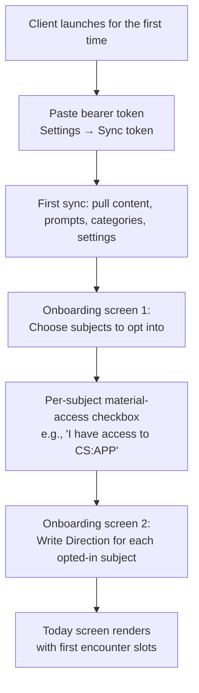

# ADR 0012 — Admin role, admin UI, first-launch onboarding

**Date:** 2026-06-09
**Status:** Accepted
**Companion to:** [ADR 0011](./0011-content-as-server-data.md) — same commit; 0011 covers content + configuration storage and sync; 0012 covers who edits it and how the user first encounters whetstone.

## Context

[ADR 0011](./0011-content-as-server-data.md) put content, prompt templates, category definitions, and default settings into the server's Postgres as runtime data. Two questions remain: **who edits this data, and what does the very first launch of whetstone look like?**

Both questions are about the convictions, not the architecture.

**The who question** matters because the prompts that judge user content are themselves a control surface for the convictions. A prompt that softens its judgment of mirror responses creates the appearance of growth where there is none. A prompt that grades a vocabulary card more strictly than the methodology calls for makes the user feel they are failing. The temptation for an agent (any agent, including a well-meaning Developer) to "improve" a prompt is real and dangerous: agents iterate on visible failure, and a prompt that produces mild user-facing irritation will be a magnet for tuning. That tuning would happen without the user noticing, and would drift the convictions invisibly. The defense has to be structural, not policy-based.

**The first-launch question** matters because the user's first artifact in whetstone sets the relationship. If the first thing the user does is accept an app-proposed encounter, whetstone is positioned as a recommender. If the first thing the user does is write their Direction, whetstone is positioned as a witness to their own declaration of why they are studying. [Conviction #5](../STABLE.md#the-six-convictions) ("your past self is the rubric") and the [Direction methodology](../STABLE.md#direction--the-identity-anchor-per-subject) both put the user's authored intent at the center; the onboarding flow has to start there.

Three user decisions were locked in [DRAFT.md](../DRAFT.md) before this ADR:

1. Admin role is human-only. Agents do not edit materials, prompts, or category definitions.
2. Admin UI lives inside the whetstone client, gated by an admin scope on the bearer token.
3. First-launch onboarding sequence: subject opt-in → Direction → first encounter.

This ADR addresses each.

## Decision

### 1. Admin is a human-only role

A new role joins the team table in [COWORK.md](../COWORK.md): **Admin**. Owned by the human, agents excluded. The Admin's surfaces:

| Admin owns | Edited via |
|---|---|
| Curated materials (works, chapters, sections, encounter units) | Admin UI inside whetstone client |
| Prompt templates (one per LLM-touching moment, versioned) | Admin UI inside whetstone client |
| Category definitions (template, weight, revisit-method binding, slot sizing) | Admin UI inside whetstone client |
| Default settings (daily budget, cap, ritual list, FSRS defaults) | Admin UI inside whetstone client |
| Bearer token (the auth root for sync + admin) | SSH to MBP (per [ADR 0008](./0008-system-architecture.md) §8) |

The hard stop in [AGENTS.md](../AGENTS.md) (already added by the user in commit `74781c2`) makes this binding for every agent in the team: *"Do not edit curated materials, prompt templates, category definitions, or default settings. These are server-resident data curated by the human Admin role. Agents do not tune the prompts that judge user content, do not edit the materials users read, and do not redefine the categories. If implementation requires reading these as data, fetch them through the proper interface; never hard-code them in source."*

The corresponding reject pattern lands in [REVIEW_SPEC.md](../REVIEW_SPEC.md): **a PR that introduces a string literal in source that looks like a prompt template, a curated material, or a category template is rejected; the data belongs in the admin-edited tables (per [ADR 0011](./0011-content-as-server-data.md)).**

**Admin is the user** in v1 and almost certainly for years. There is no v1 capability to grant admin scope to a non-human; there is no v1 capability to grant admin scope to a second human. The role exists in [COWORK.md](../COWORK.md) so the boundary is explicit, not because two humans will share it.

### 2. Admin UI lives inside the whetstone client

The admin UI is **not a separate webapp, not a separate binary, not a separate codebase**. It is an `Admin/` folder of Blazor pages inside the same MAUI Blazor Hybrid client described in [ADR 0008](./0008-system-architecture.md) §4 and §9. The folder joins the existing flat layout:

```
client/
├── ...existing folders from ADR 0008 §9...
└── Admin/                  ContentEditor, PromptEditor, CategoryEditor,
                            SettingsEditor, VersionHistory, OnboardingFlow
```

Pages in `Admin/` check a single condition before rendering: **the bearer token configured in this client carries the admin scope**. Without admin scope, navigating to an admin URL renders a "you don't have admin access" component (not a 404 — the user should be able to see the surface exists without being able to use it).

#### Admin scope on the bearer token

[ADR 0008](./0008-system-architecture.md) §8 introduced the shared bearer token. This ADR extends it: tokens carry a **scope**, which is one of:

- `admin` — full access. Sync + read everything + write everything via `POST /v1/admin/...` endpoints.
- `user` — sync access only. Read + write notes; read content/prompts/categories/settings; no `POST /v1/admin/...`.

**Token shape**: still a 64-character hex string, but the server stores per-token metadata in a `tokens` table:

```
tokens
├── token_hash     bytea PK         (SHA-256 of the token; raw token never stored)
├── scope          enum: admin | user
├── label          text             (e.g. "MBP admin", "phone", "work laptop")
├── created_at     timestamptz
├── last_used_at   timestamptz
└── revoked_at     timestamptz      (null if active)
```

**First-boot token is admin**: [ADR 0008](./0008-system-architecture.md) §8's first-issuance flow (server generates a 64-char hex token, logs once to stdout with banner) issues an admin-scoped token. The human pastes it into the first client (which becomes the admin client) and into the admin UI itself. From that admin client, the human can issue additional user-scoped tokens for other devices via the admin UI (`POST /v1/admin/tokens`).

**Token revocation** is `UPDATE tokens SET revoked_at = NOW() WHERE ...`. The server checks `revoked_at IS NULL` on every auth.

**Server endpoint surface added by this ADR** (extends [ADR 0008](./0008-system-architecture.md) §11 and [ADR 0011](./0011-content-as-server-data.md) §3):

| Endpoint | Scope required | Purpose |
|---|---|---|
| `POST /v1/admin/materials` | admin | Create / update / soft-delete materials. |
| `POST /v1/admin/prompts` | admin | Save a new prompt template version. |
| `POST /v1/admin/prompts/activate` | admin | Activate a specific version of a prompt template. |
| `POST /v1/admin/categories` | admin | Edit category definitions. |
| `POST /v1/admin/settings` | admin | Edit default settings. |
| `POST /v1/admin/tokens` | admin | Issue a new bearer token (scope chosen by admin). Returns the raw token once. |
| `POST /v1/admin/tokens/revoke` | admin | Revoke a token by hash. |
| `GET /v1/admin/tokens` | admin | List tokens (hash prefix only, never raw). |
| `GET /v1/admin/history?noteId=...` | admin | Already defined in [ADR 0008](./0008-system-architecture.md) §11 — now formally admin-scoped. |
| `GET /v1/admin/metrics` | admin | Already defined in [ADR 0008](./0008-system-architecture.md) §11 — now formally admin-scoped. |

All admin writes carry the `change_id` idempotency contract from [ADR 0008](./0008-system-architecture.md) §11.

#### Admin UI surfaces in v1

The minimum for v1:

| Surface | What it does |
|---|---|
| **Content editor** | Tree view of subjects → works → chapters → sections → units. Per-unit edit pane with title, body (or citation + acceptance for reference-only), kind, ordinal. Soft-delete button. |
| **Prompt editor** | List of prompt template keys with active version. Per-key: edit form (system, user, model, max_tokens, temperature, placeholders), save-as-new-version button, version history list with "activate" button per version, "diff vs active" view. |
| **Category editor** | List of categories with edit pane: template, default weight, revisit-method binding (read-only — changing this would invalidate scheduler state), slot-sizing JSON. |
| **Settings editor** | Key/value pane for default settings (daily budget, cap, ritual list, FSRS initial params). |
| **Token manager** | List of tokens with label / scope / last-used / revoke. Issue new token form (label + scope). |
| **History viewer** | Look up archived note versions by note id (the recovery escape hatch from [ADR 0008](./0008-system-architecture.md) §6c). |
| **Server metrics viewer** | Render the rolling-window ops metrics from [ADR 0008](./0008-system-architecture.md) §8. |

**Not in v1**: A/B testing prompts, prompt preview (run a draft prompt against sample input without activating), bulk import of materials, content search beyond tree navigation, multi-user permissions UI. All v1.5+.

### 3. First-launch onboarding

The flow when a freshly-installed client connects to a freshly-installed server (or to an established server but with no opted-in subjects yet for the user).

#### The sequence: subject opt-in → Direction → first encounter



**Onboarding screen 1 — subject opt-in:**

```
┌───────────────────────────────────────────────────────────────┐
│ Which subjects do you want to study?                          │
│                                                               │
│ Choose any (you can add more later in Settings).              │
│                                                               │
│ [ ] 史记 — Literary narrative, in order.                       │
│ [ ] Recitation — 滕王阁序, 洛神赋, 笠翁对韵.                       │
│ [ ] Orwell essays — Prose-modeling, starting with             │
│     'Politics and the English Language'.                      │
│ [ ] CS:APP — Concept / mechanism. Whetstone holds the         │
│     chapter list and your notes;                              │
│     you read the book yourself.                               │
│     [ ] I have access to the book.                            │
│ [ ] Reflection — Diary. Always available.                     │
│                                                               │
│ [ Continue ]                                                  │
└───────────────────────────────────────────────────────────────┘
```

The CS:APP access checkbox is gating: opt-in only if the user has the book. Reflection is always-available; it has no material so no opt-in friction. The other three are server-held materials and require nothing more than ticking the box.

**Onboarding screen 2 — Direction per opted-in subject:**

The user sees one Direction-writing screen per opted-in subject, sequentially. Each screen renders:

```
┌───────────────────────────────────────────────────────────────┐
│ Why are you studying 史记?                                     │
│                                                               │
│ In one or two sentences, declare why you are studying this    │
│ and what success looks like in 6–12 months.                   │
│                                                               │
│ Not a SMART goal, not a curriculum — a declaration.           │
│                                                               │
│ Examples:                                                     │
│   "I want to know 史记 well enough to talk about the          │
│    major figures without notes. Pace doesn't matter."         │
│                                                               │
│ ┌─────────────────────────────────────────────────────────┐  │
│ │                                                         │  │
│ │  [user writes here]                                     │  │
│ │                                                         │  │
│ └─────────────────────────────────────────────────────────┘  │
│                                                               │
│ [ Continue ]                                                  │
└───────────────────────────────────────────────────────────────┘
```

No "skip" button. Reading the Direction at the start of weekly Echo reviews ([STABLE.md → Weekly Echo](../STABLE.md#weekly-echo-review-every-7th-day-replaces-the-standard-routine)) is part of the methodology; a subject without a Direction breaks Echo. The user must write something — even one sentence — before continuing.

**Onboarding screen 3 (implicit) — Today screen with first encounter slots:**

After all Directions are written, the user lands on the Today screen. Since no notes exist yet, the routine has no revisits. The Today screen for a fresh user shows:

- A welcoming header acknowledging this is the first session.
- One encounter slot per opted-in subject (sized by category weight from default settings).
- Each encounter slot has an LLM-generated proposal, anchored on the just-written Direction.
- Ritual slot if a ritual list is configured (admin can set; default v1 ritual is 笠翁对韵).
- No Echo (Echo only fires on the 7th day from app install per the methodology).

The first encounter the user accepts becomes the first note in their whetstone library. From here forward, the standard daily loop applies.

#### Why this sequencing matters

- **Subject opt-in first** lets the user feel they are choosing whetstone, not the other way around. The materials are admin-curated, but the engagement is opt-in.
- **Direction before encounter** means the user's first writing in whetstone is their own declaration of why they are studying. The Direction is then visible to the LLM proposal, so the first encounter the user accepts is one that explicitly references their Direction. Conviction #5 is honored from the first artifact.
- **No "explore the app first" tutorial step.** The first session is the first real session, scaled down. The user learns whetstone by using it, not by reading about it.

#### Subsequent fresh-client installs (existing server, existing user)

When the user installs whetstone on a second device after the first is set up, the flow is simpler:

1. Paste bearer token (same token the user already issued for themselves, or a new user-scoped token issued via admin UI on the first device).
2. First sync pulls everything the user has — notes, subjects, Directions, content, prompts, categories, settings.
3. Today screen renders the same routine the first device sees.

No re-onboarding. The Direction is already written, the subjects are already opted in, the user is already a whetstone user — the second device just joins.

### 4. Anti-rule check

- **No new seam.** Admin endpoints are HTTP routes on the existing server; no `IAdminService` abstraction. Admin UI pages use the existing `INoteStore` for cache access and direct HTTP calls for writes (the writes are infrequent and surgical; no Anthropic-style fallback wrapper needed). Four-seam rule holds.
- **No `*Manager`.** No `AdminManager`, no `TokenManager`. Admin write logic lives in admin controller classes named for what they do (`MaterialAdminController`, `PromptAdminController`, `TokenAdminController`).
- **No background workers, no message queues.** Admin UI is synchronous request/response.
- **No new dependencies.** Admin UI uses existing Blazor + the existing HTTP client; no new NuGet packages.

## Alternatives considered

- **Admin as a separate webapp / second container.** Rejected. Doubles the operational surface (second container, second build, second sync). Same authentication story across two surfaces. The MAUI Blazor client already supports the admin page surface; reusing it is the smaller-cost path.
- **Admin as a CLI tool on the server (SSH + `whetstone-admin` command).** Rejected. Editing prompt templates in a CLI is hostile; multi-line Markdown content for materials is hostile in a shell; the admin needs a real editor surface. A UI is the right shape; the question is only where it lives.
- **Admin via direct DB access (psql on the MBP).** Rejected for the same reasons plus: no validation (admin can write a template with `{placeholder}` that no code knows how to fill), no audit (no `created_by`, no version history without ceremony), no rollback (one UPDATE wins forever).
- **No admin scope on tokens — just a separate "admin password" the admin UI prompts for.** Rejected. Two auth secrets instead of one is worse, not better. The token-scope mechanism is the right abstraction; one secret, with scope.
- **Issue an admin token by typing it into the client and the client asks the server "do I have admin?"** Rejected. Equivalent to scope-on-token but with extra round-trip. Scope-on-token is simpler.
- **Granular permissions** (read-materials, write-materials, read-prompts, write-prompts, ...). Rejected for v1. Two scopes is enough; admin is the user; partial-admin scenarios don't exist yet. Multi-admin → multi-scope is a v2 amendment.
- **Onboarding: free-write Direction at any time, no required first-screen Direction.** Rejected. The methodology requires every subject to have a Direction (for Echo, for LLM proposal anchoring). Making it optional creates a class of subjects-without-Directions that the rest of the code has to handle — and Echo breaks for them. Required at opt-in is the right shape.
- **Onboarding: LLM-suggested Direction the user accepts or edits.** Rejected. The Direction is the user's identity-anchor; an LLM-authored Direction is the LLM prescribing the user's values, which directly contradicts the [AGENTS.md](../AGENTS.md) hard stop on "Do not change a Direction without the user editing it themselves." The user writes the first version; the LLM never proposes one. (The LLM can summarize the Direction back to the user in the Echo flow; that is summary, not authoring.)
- **Onboarding: skip the subject opt-in, opt every user into all five categories by default.** Rejected. Forces engagement with subjects the user may not care about; gives the LLM a wider proposal space than the user has signed up for; surfaces CS:APP material before the user has confirmed they own the book. Opt-in is the conviction-aligned shape.
- **Onboarding: defer Direction-writing to a "do this when you have time" prompt later.** Rejected. The first encounter slot needs a Direction to anchor the proposal; without it, the LLM has nothing to ground the proposal in. Direction at opt-in is structural, not aspirational.
- **Tutorial / "learn the app" screens before the first real session.** Rejected. The first session is the first real session. The app is the tutorial. (This matches the user-stated reason whetstone exists per [ADR 0006](./0006-voice-first-class.md#context) — fewer tools, less friction, more time inside the work.)
- **Hide admin UI entirely from the user-scoped client surface.** Considered. Rejected in favor of "show that the surface exists but block access," because: the admin is the user, and even on a user-scoped device the user should know that the admin surface exists and how to reach it (paste an admin token, get access). Discoverability matters more than hiding-by-default for a personal app.

## Consequences

**Positive:**

- **The convictions are defended at the prompt layer continuously and structurally.** No agent can quietly retune the prompt that judges user content because the hard stop is at the file level (don't edit content/prompts/categories in source) and the data is not in source.
- **The first session is conviction-aligned**. The user's first whetstone artifact is their own Direction, not an app-proposed encounter. Conviction #5 is honored from the first moment the user touches the app.
- **One MAUI Blazor codebase** holds both user and admin surfaces. No second app, no second deploy pipeline, no second build artifact.
- **Token-scope mechanism scales to multi-device cleanly**. Admin issues a user-scoped token from their first device; subsequent devices get that token; admin token stays on one device or rotates as needed.
- **First-install bootstrap is honest**: the user-as-admin populates the first content via the admin UI; no seed data shipped in source, no implicit "whetstone has opinions about what 史记 chapters you should read first" baked into the binary.

**Negative / accepted risk:**

- **Required Direction at opt-in adds onboarding friction**. The user cannot skip past it to "see what the app looks like." This is intentional cost; the user signed up for a guide-with-conviction, not a sandbox. If users (plural) ever exist and abandon during onboarding, revisit.
- **Admin UI inside the user app means a user-scoped device can navigate to `/admin/...` URLs and see the "you don't have admin access" screen**. Some users will find this surprising. Acceptable; the surface should be discoverable.
- **Bootstrap requires the admin to populate at least one subject's material before the first user-facing session is useful**. For the user-who-is-also-admin this is correct; the first thing the admin does is set up content. If admin and user ever diverge (a friend installs whetstone with the user as their admin), this bootstrap story is wrong; deferred to v1.5+.
- **Token rotation now affects scope**. The admin must remember when issuing a new token: is this an admin token or a user token? Mitigation: the admin UI form has scope as a required field with default "user" and a confirmation prompt for "admin."
- **A leaked admin token grants full content / prompt edit access**. Mitigation: rotate via SSH + admin UI revocation. Same as [ADR 0008](./0008-system-architecture.md) §8 — bearer token compromise is rotated, not patched around.
- **The admin UI is now a v1 work item** that earlier scope didn't include explicitly. [STABLE.md](../STABLE.md) Scope (v1) is updated in this commit to add it as item 15.
- **The history viewer surfaces archived note versions to the admin** — a user with admin access can see prior versions of their own notes (via [ADR 0008](./0008-system-architecture.md) §6c history table). For the single-user-who-is-also-admin this is correct. For any multi-user future, this is a privacy concern that needs ACL revisit.

## Revisit triggers

- **A second human ever uses whetstone** (friend, family, small team): the single-admin assumption breaks; multi-admin scopes, ACLs on materials per user, separate Direction-per-user-per-subject all become real. New ADR.
- **Onboarding completion rate drops below 100%** in any context (right now there is only one user, so this is a future concern): revisit required-Direction gating.
- **Admin makes a bad prompt activation that goes unnoticed** for days: revisit admin UI's surface for grading-quality monitoring; consider a "prompt diff requires confirmation if changes are large" UX guard.
- **Bootstrap pain is real for non-admin users** (only relevant after multi-user): consider seed content shipped with the server image as an opt-in starter pack.
- **Per-device default settings** become desired (e.g., user wants a higher daily budget on desktop than on phone): extend the settings model with per-device overrides. Probably a v1.5 amendment.
- **Admin UI surfaces beyond v1's minimum** are wanted (A/B test prompts, preview without activating, bulk import): v1.5 amendments. The minimal v1 surface is intentionally narrow to ship.
- **A token compromise incident**: revisit the bearer-token-only model in favor of password + token, or short-lived tokens with refresh. New ADR.
